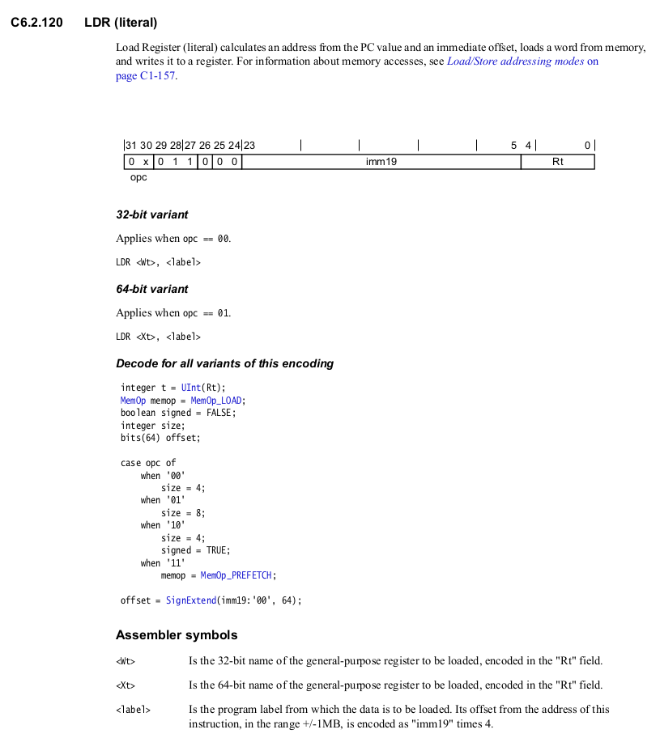

___Billet en construction; à lire à vos risques et périls___

# Chargements et alignement en mémoire

Une personne a obtenu une erreur en apparence étrange lors de la réalisation du labo 3:

```
relocation truncated to fit: R_AARCH64_LD_PREL_LO19 against `.bss'

warning: One possible cause of this error is that the symbol is being referenced in the
indicated code as if it had a larger alignment than was declared where it was defined.
```

J'ai réussi à corriger l'erreur en laboratoire, mais sans réellement la comprendre.
Voici un exemple minimal qui la reproduit:

```asm
.global main

main:
    ldr     x19, bar

    mov     x0, 0
    bl      exit

.section ".bss"
foo:        .skip   1
bar:        .skip   8
```

Ce code déclare deux données dans la mémoire principale: ```foo``` qui
contient un seul octet, et ```bar``` qui en contient huit. Le programme
devrait simplement charger le contenu de ```bar``` dans ```x19```,
puis se terminer. Toutefois, le code ne compile pas; l'assembleur lance
l'erreur décrite plus tôt.

Cette variation, en apparence équivalente, du code est fonctionnelle:

```asm
.global main

main:
    ldr     x19, bar

    mov     x0, 0
    bl      exit

.section ".bss"
bar:        .skip   8     //  Ordre inverse 
foo:        .skip   1     //        des déclarations
```

C'est de cette façon que j'ai corrigé l'erreur en laboratoire...
mais pourquoi est-ce que ça fonctionne?

# Alignement mémoire

La ligne problématique est ```ldr     x19, bar```. Si on la retire, le
le code compile. Cette ligne utilise l'instruction ```ldr``` avec
le mode d'adressage appelé «littéral» dans la documentation d'ARMv8,
c'est-à-dire où l'adresse est spécifiée par une étiquette:


